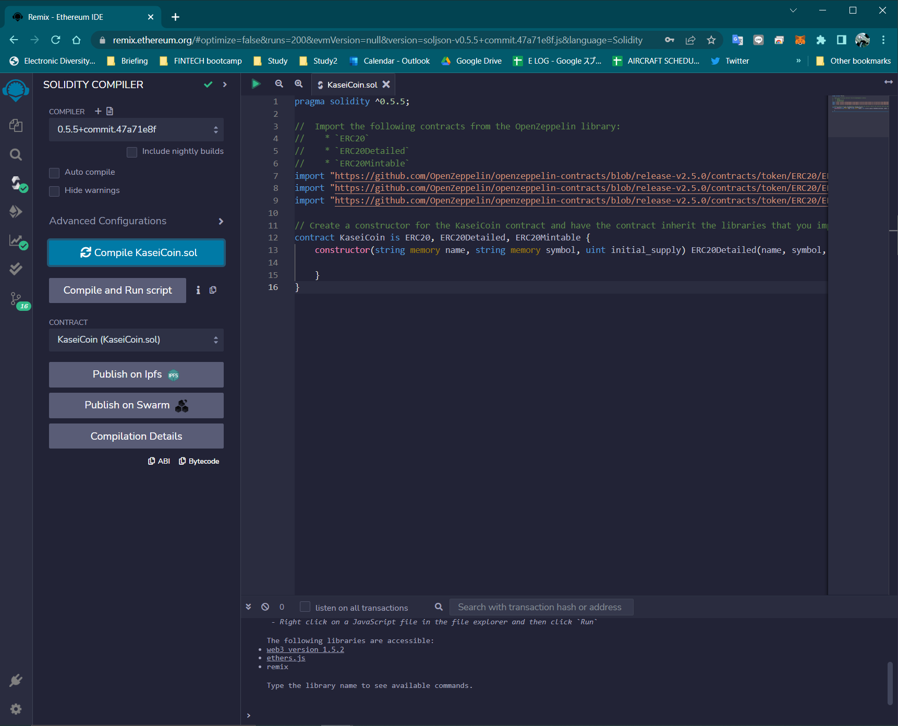
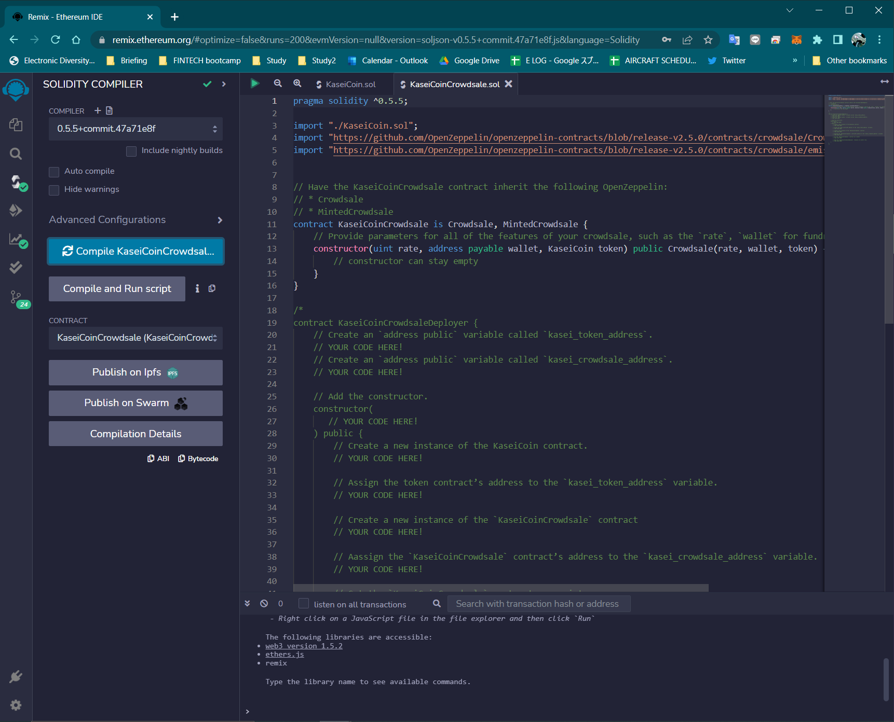
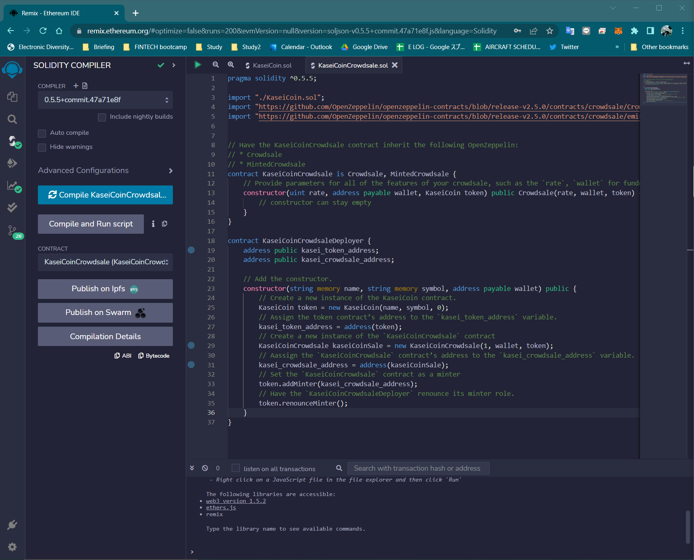
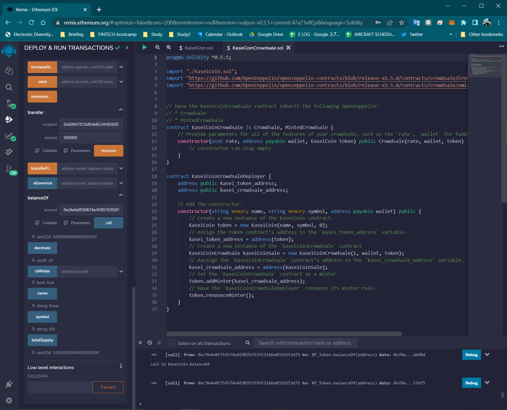
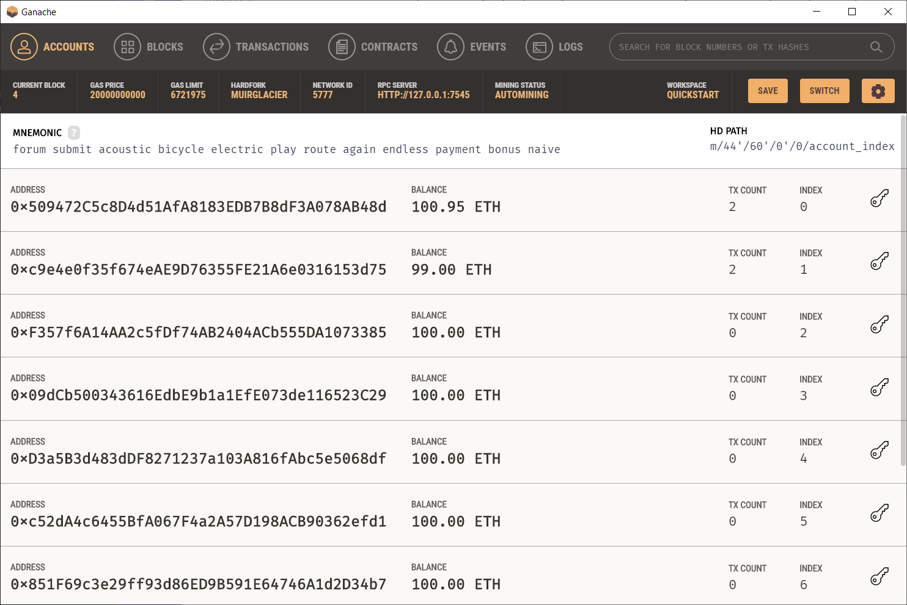
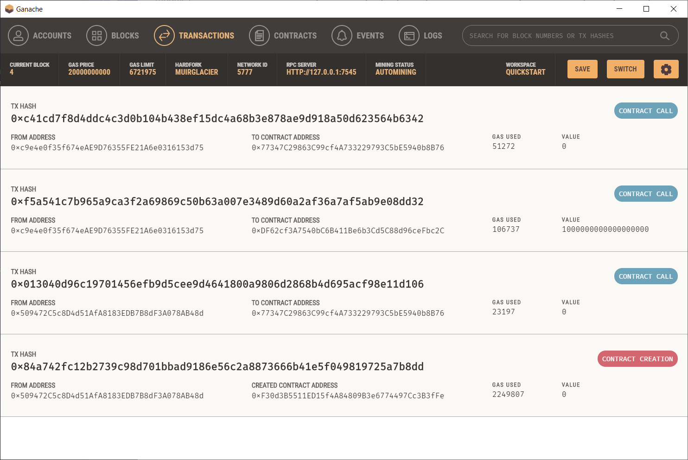

# module_21_challenge

Kasei Coin is a fungible token that is ERC-20 compliant and that will be minted by using a Crowdsale contract from the OpenZeppelin Solidity library.

## REMIX Development Screenshots

Kasei Coin Contract

Kasei Coin Cloudsale Contract

Kasei Coin Deployer Contract

## Kasei Coin Demo Screenshots

Remix Deployment

Ganache accounts after transactions

Ganache transactions record

## Technology

`solidity 5.5.0`

`Metamask`

`Ganache`